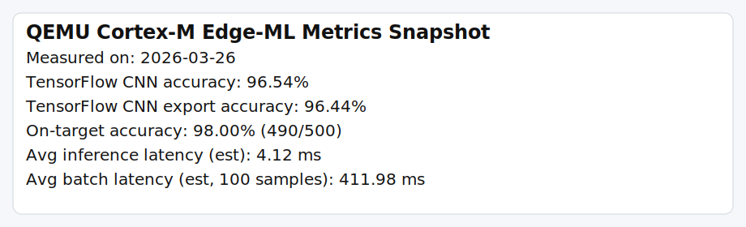
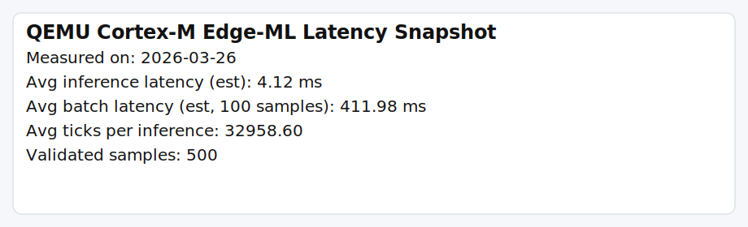

# ARM Cortex-M3 Bare-Metal Edge-ML Emulation with QMP

This project demonstrates an end-to-end edge-AI workflow on an emulated
microcontroller target:

1. Train TensorFlow models (CNN and deployable FC) on MNIST on the host
2. Export trained weights into a C header
3. Run framework-free inference in bare-metal C++ on Cortex-M3 in QEMU
4. Validate correctness and latency through a Python QMP + UART harness

Target board: TI Stellaris LM3S6965 (ARM Cortex-M3), emulated by QEMU.

## Why this is useful

This setup mimics pre-silicon edge-ML bring-up:

- no OS
- no dynamic memory
- no framework runtime on target
- host-driven automation for architecture checks, health checks, and ML telemetry

## Project Structure

```text
qemu-cortexm-demo/
├── src/
│   ├── main.cpp                    # Bare-metal C++ firmware + UART telemetry
│   ├── startup.s                   # Vector table + Reset_Handler
│   ├── lm3s6965.ld                 # Memory map linker script
│   └── ml/
│       ├── mnist_model.hpp         # No-heap templated layer definitions
│       ├── mnist_model.cpp         # CNN inference path (conv/relu/pool/dense)
│       └── mnist_weights_generated.h
├── tools/
│   └── train_export_mnist.py       # TensorFlow training + C header export
├── qmp_client.py                   # QMP + UART validation and metrics
├── Makefile
└── README.md
```

## Requirements

- QEMU: brew install qemu
- ARM embedded toolchain: brew install --cask gcc-arm-embedded
- Python 3
- TensorFlow (only needed for training/export): pip install tensorflow

## Quick Start

```bash
# Build bare-metal firmware with the currently checked-in header
make build

# Run emulator
make run

# Execute QMP + UART validation
make test
```

## Train and Export Weights

```bash
# Train a compact CNN and overwrite src/ml/mnist_weights_generated.h
make export-weights

# Rebuild and retest with exported weights
make build
make test
```

The deployable export script uses an FC model for flash fit on LM3S6965:

- 784 -> 40 -> 20 -> 10 logits

## Verified Metrics

Measured in this repo on March 22, 2026:

- TensorFlow CNN (Conv2D(8) + MaxPool + Dense): 96.54% MNIST test accuracy, 13,610 parameters
- TensorFlow FC export model (784 -> 40 -> 20 -> 10): 95.91% MNIST test accuracy, 32,430 parameters
- On-target validation in QEMU: 490/500 correct predictions across 5 benchmark batches (100 samples each), 98.00% accuracy
- On-target estimated latency: 4.05 ms average per inference from SysTick ticks (8 MHz estimate)
- On-target estimated batch latency: about 405 ms per 100-sample benchmark batch

## Metric Snapshot

The repository includes a generated metrics snapshot artifact for quick visual verification:



Dedicated latency snapshot:



You can regenerate this artifact after rerunning training and QEMU tests with:

```bash
python tools/generate_metrics_snapshot.py
```

If local build artifacts are unavailable, the generator falls back to committed baseline metrics in docs/assets/metrics_data.json.

Note: a float32 784 -> 128 -> 64 -> 10 network is about 109K parameters and does not fit this target flash when stored as raw float32 weights.

## Firmware Telemetry Format

The firmware prints machine-parseable UART lines such as:

```text
INFER pred=7 expected=7 ok=1 ticks=18432
HEARTBEAT 42
```

The QMP harness parses these lines to compute:

- samples validated
- prediction correctness/accuracy
- average/min/max SysTick tick cost
- estimated latency in ms

## C++ Constraints and Design

The inference code intentionally follows embedded constraints:

- no std::vector, std::map, or heap allocation
- no exceptions and no RTTI
- no framework runtime on target
- compile-time dimensions via templates
- stack/static fixed-size buffers only

Layer classes are implemented in src/ml/mnist_model.hpp and mirror the style
used in production embedded ML stacks.
